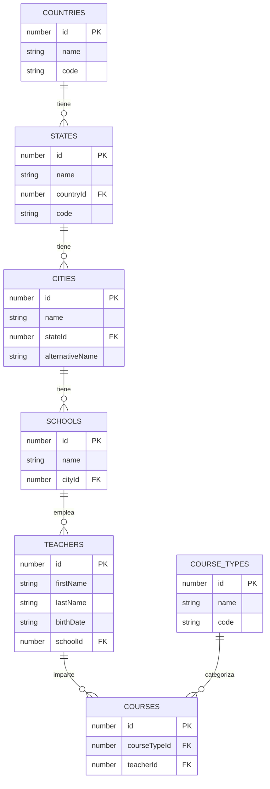

# Backend Server - Frontend Technical Test

Express server con datos dummy para la prueba técnica de frontend.

## ⚠️ Disclaimer Importante

Si el backend no funciona, presenta bugs, o encuentras requerimientos **IMPOSIBLES** de implementar con las limitaciones impuestas, **coméntalo al entrevistador**. El entrevistador te dará autorización para modificar el backend o eliminar ese requerimiento específico.

## Setup

```bash
npm install
npm start
```

Servidor corre en `http://localhost:3001`

## Pruebas

Para ejecutar las pruebas de integración de los endpoints:

```bash
npm install
npm test
```

Para ejecutar las pruebas en modo watch:

```bash
npm run test:watch
```

Las pruebas están ubicadas en `tests/api.test.js` y cubren todos los endpoints del API, incluyendo:
- Autenticación y validación de tokens
- Todos los endpoints GET con sus filtros
- Creación de profesores con validaciones
- Manejo de errores (400, 401, 404)
- Paginación de cursos

## Autenticación

Todos los endpoints (excepto `/api/login`) requieren el header:
```
Authorization: Bearer token-secreto-123
```

### POST /api/login

Autenticación del usuario.

**Request Body:**
| Campo | Tipo | Requerido | Descripción |
|-------|------|-----------|-------------|
| `username` | string | Sí | Nombre de usuario |
| `password` | string | Sí | Contraseña |

**Response:**
| Campo | Tipo | Descripción |
|-------|------|------------|
| `token` | string | Token de autenticación |
| `user` | object | Información del usuario |
| `user.username` | string | Nombre de usuario |
| `user.name` | string | Nombre completo |
| `user.photo` | string | URL de foto |

**Errores:**
- `400`: Usuario y contraseña son requeridos
- `401`: Credenciales inválidas

---

## Endpoints

### GET /api/countries

Obtiene todos los países o filtra por nombre.

| Parámetro | Tipo | Requerido | Descripción |
|-----------|------|-----------|-------------|
| `name` | string | No | Búsqueda parcial por nombre (case-insensitive) |

**Response:** Array de objetos con `id`, `name`, `code`

**Nota:** ✅ Puedes guardar esta lista en client-side para tener cache.

---

### GET /api/states

Obtiene todos los estados o filtra por país y/o nombre.

| Parámetro | Tipo | Requerido | Descripción |
|-----------|------|-----------|-------------|
| `countryId` | number | No | Filtra estados por ID de país |
| `name` | string | No | Búsqueda parcial por nombre (case-insensitive) |

**Response:** Array de objetos con `id`, `name`, `countryId`, `code`

**Nota:** ❌ NO puedes guardar esta lista en client-side, debes solicitarla siempre que vayas a usarla.

---

### GET /api/cities

Obtiene todas las ciudades o filtra por estado y/o nombre.

| Parámetro | Tipo | Requerido | Descripción |
|-----------|------|-----------|-------------|
| `stateId` | number | No | Filtra ciudades por ID de estado |
| `name` | string | No | Búsqueda parcial por nombre (case-insensitive) |

**Response:** Array de objetos con `id`, `name`, `stateId`, `alternativeName` (opcional)

**Nota:** ❌ NO puedes guardar esta lista en client-side, debes solicitarla siempre que vayas a usarla.

---

### GET /api/schools

Obtiene todas las escuelas o filtra por ciudad y/o nombre.

| Parámetro | Tipo | Requerido | Descripción |
|-----------|------|-----------|-------------|
| `cityId` | number | No | Filtra escuelas por ID de ciudad |
| `name` | string | No | Búsqueda parcial por nombre (case-insensitive) |

**Response:** Array de objetos con `id`, `name`, `cityId`

**Nota:** ❌ NO puedes guardar esta lista en client-side, debes solicitarla siempre que vayas a usarla.

---

### GET /api/teachers

Obtiene todos los profesores. Puede filtrar por país, estado, ciudad o nombre.

| Parámetro | Tipo | Requerido | Descripción |
|-----------|------|-----------|-------------|
| `countryId` | number | No | Filtra profesores por ID de país |
| `stateId` | number | No | Filtra profesores por ID de estado |
| `cityId` | number | No | Filtra profesores por ID de ciudad |
| `name` | string | No | Búsqueda parcial por nombre completo (firstName + lastName, case-insensitive) |
| ~~`schoolId`~~ | number | No | ~~No se puede filtrar por schoolId en server-side, debe hacerse manualmente en el frontend~~ |

**Response:** Array de objetos con `id`, `firstName`, `lastName`, `birthDate`, `schoolId`

**Nota:** La respuesta solo incluye el `schoolId`. No incluye `cityId`, `stateId` ni `countryId` para mantener la respuesta simple.

**Limitaciones:**
- ❌ NO puedes filtrar por `schoolId` en server-side (debe hacerse client-side)
- ❌ El paginador debe hacerse client-side

---

### GET /api/teachers/:id

Obtiene un profesor específico con toda su información relacionada.

**Response:** Objeto con `id`, `firstName`, `lastName`, `birthDate`, `schoolId`, `school` (objeto), `city` (objeto), `state` (objeto), `country` (objeto), `courses` (array de objetos con `courseType` anidado)

**Errores:**
- `404`: Profesor no encontrado

---

### POST /api/teachers

Crea un nuevo profesor y lo guarda en `teachers.json`. El ID se autogenera automáticamente.

**Request Body:**
| Campo | Tipo | Requerido | Validación |
|-------|------|-----------|------------|
| `firstName` | string | Sí | No vacío |
| `lastName` | string | Sí | No vacío |
| `birthDate` | string | Sí | Formato YYYY-MM-DD |
| `schoolId` | number | Sí | Debe existir en schools |

**Response:** Objeto con `id` (autogenerado), `firstName`, `lastName`, `birthDate`, `schoolId`

**Nota:** El `id` se genera automáticamente basándose en el total de profesores existentes. No es necesario enviarlo en el request.

**Errores:**
- `400`: Campos requeridos faltantes / Validación fallida / SchoolId no existe
- `500`: Error al guardar el profesor

---

### GET /api/courseTypes/:id

Obtiene un tipo de curso específico por ID.

**Response:** Objeto con `id`, `name`, `code`

**Errores:**
- `404`: Tipo de curso no encontrado

**Nota:** ✅ Puedes guardar esta lista en client-side para tener cache.

---

### GET /api/courses/:id

Obtiene un curso específico por ID.

**Response:** Objeto con `id`, `courseTypeId`, `teacherId`

**Errores:**
- `404`: Curso no encontrado

---

### GET /api/courses/paginated

Obtiene cursos paginados con filtro opcional por profesor.

| Parámetro | Tipo | Requerido | Default | Descripción |
|-----------|------|-----------|---------|-------------|
| `teacherId` | number | No | - | Filtra cursos por ID de profesor |
| `page` | number | No | 1 | Número de página |
| `limit` | number | No | 10 | Items por página |

**Response:** Objeto con `data` (array de cursos con `id`, `courseTypeId`, `teacherId`, `teacherName`, `schoolName`) y `pagination` (objeto con `page`, `limit`, `total`, `totalPages`)

**Nota:** El nombre del tipo de curso (`courseType.name`) NO viene incluido. Debes obtenerlo usando `/api/courseTypes/:id`. Pista: ✅ Puedes guardar esta lista en client-side para tener cache.

---

## Diagrama de Relaciones (ERD)



## Estructura de Datos

- **Countries**: 2 países (Venezuela, Colombia)
- **States**: 5 estados (3 de Venezuela, 2 de Colombia)
- **Cities**: 13 ciudades (1-3 por estado)
- **Schools**: 17 escuelas (1-3 por ciudad, Ciudad Guayana tiene 3)
- **Teachers**: ~43 profesores (5 por escuela en Ciudad Guayana, 2 en otras)
- **Course Types**: 60 tipos de cursos
- **Courses**: ~280 cursos (12-15 por profesor en Ciudad Guayana, 2-3 en otras ciudades)
